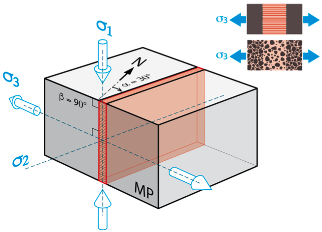

# Tecto Stress

  

Tecto-Stress is a web application that enables tectonic stress inversion by utilizing various types of data such as fault striae, fracture orientation..., and combining them to better constrain the inversion.

This webapp relies on the library [@alfredicus/stress](https://github.com/alfredicus/stress), also developed by [Geoscience-Montpellier](http://www.gm.univ-montp2.fr/) and [YouWol](youwol.com).

 

  

