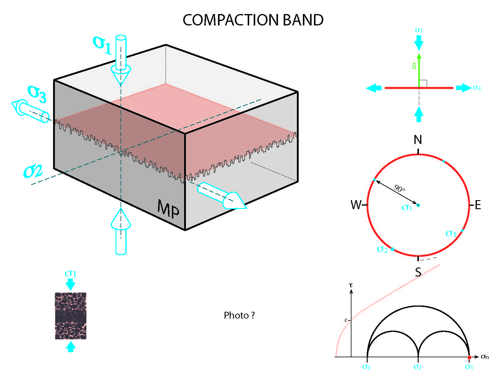

← [Back to Deformation Bands](../deformationBands.md)

# Compaction Band

You can define compaction bands in the stress analysis 

1. Kinematic and Mechanical Analysis

    

2. Input File

    - [Excel File](./inputFiles/excelFile.md)

### References
- [Polygonal fault systems and channel boudinage: 3D analysis of multidirectional extension in analogue sandbox experiments](https://www.researchgate.net/publication/229182350_Polygonal_fault_systems_and_channel_boudinage_3D_analysis_of_multidirectional_extension_in_analogue_sandbox_experiments)