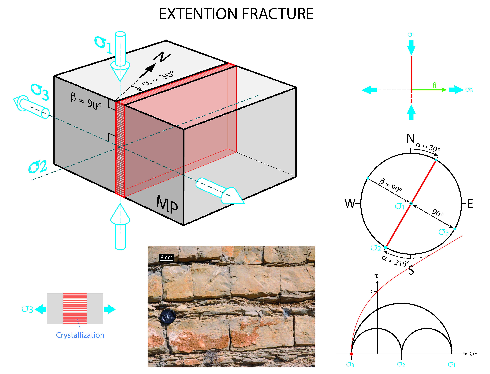

← [Back to Extension Fractures](../extensionFractures.md)

# Extension Fracture

You can define extension fractures in the stress analysis, by considering that they are perpendicular to the extensional stress axis sigma 3 

1. Kinematic and Mechanical Analysis

    

2. Input File

    - [Excel File](./inputFiles/excelFile.md)

### References
- [Polygonal fault systems and channel boudinage: 3D analysis of multidirectional extension in analogue sandbox experiments](https://www.researchgate.net/publication/229182350_Polygonal_fault_systems_and_channel_boudinage_3D_analysis_of_multidirectional_extension_in_analogue_sandbox_experiments)